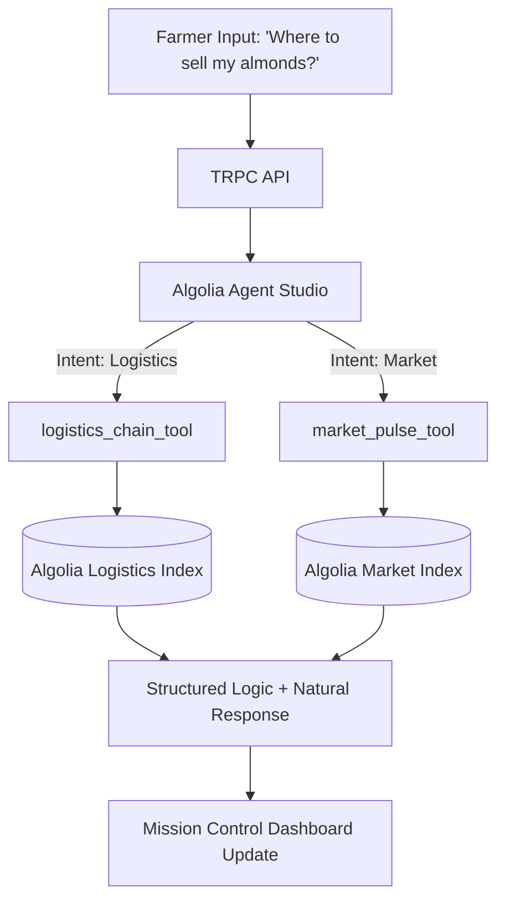

# 🚜 AgriIntel v2.1: The Intelligent Mission Control for Smart Farming

[](https://algolia.com)
[](https://opensource.org/licenses/MIT)

**AgriIntel** is a high-performance agricultural intelligence platform designed for the **Algolia Agent Studio Challenge**. It transforms complex supply chain data into actionable field decisions using state-of-the-art AI orchestration.

---

## 🌟 The Vision: Contextual Intelligence for Agriculture

Small and medium farmers often struggle with fragmented data: market prices are in one place, crop rotation rules in another, and logistics options are hidden in regional networks. 

**AgriIntel solves this by providing a unified "Mission Control" powered by Algolia Agent Studio.** Instead of traditional keyword search, farmers interact with a conversational agent that understands agronomic intent and retrieves structured data from four specialized real-time indices.

---

## 🛠 Features & Capabilities

### 🤖 1. Algolia Agent Studio Orchestration
The "Brain" of the platform. Using the `agri-intel-primary-agent`, the system automatically decides which specialized tools to use based on the farmer's query.
- **Intent Recognition**: Automatically distinguishes between a pricing question and a logistics request.
- **Multi-Index Retrieval**: Can query `market_prices`, `logistics`, and `benchmarks` simultaneously to answer complex questions.

### 📈 2. Real-Time Market Pulse
Live data feeds for commodity pricing across multiple regions (California, Midwest, Texas, etc.).
- **Demand Index**: Proprietary weighting of market interest (1-100).
- **Region-Specific Filtering**: Instant access to localized crop value data.

### 🪴 3. Agronomy Rules & Rotation
Grounding AI recommendations in scientific soil and climate zone data.
- **Risk Scoring**: Identifies disease risk between consecutive crops (e.g., Tomato ➔ Pepper).
- **Compatibility Guidance**: Suggests the optimal "Next Crop" based on history.

### 🚚 4. Logistics Chain Optimizer
Connecting the farm to the market.
- **Buyer Matching**: Direct links to regional buyers (Whole Foods, Costco, ADM).
- **Carrier Optimization**: Real-time cost-per-ton and transit day estimation.

---

## 🎨 Design Philosophy: Eco-Brutalism
AgriIntel features a custom **Eco-Brutalism** UI—a blend of raw, high-contrast industrial design with organic, earth-toned elements. 
- **Typography**: Precision mono-spaced fonts for a "command-center" feel.
- **Aesthetics**: Glassmorphism, neon-lime accents on soil-toned backgrounds.
- **Micro-interactions**: Pulse animations for active AI orchestration status.

---

## 🏗 Architecture Breakdown



### Specialized Tools Configuration
| Tool | Target Index | Parameter Logic |
| :--- | :--- | :--- |
| `market_pulse_tool` | `market_prices` | Extracts `crop` and `region` |
| `agronomy_rules_tool` | `crop_rotation` | Extracts `previous_crop` and `soil_type` |
| `logistics_chain_tool` | `logistics` | Pairs `origin` with `buyer` destinations |
| `benchmark_tool` | `benchmarks` | Compares `region` performance |

---

## 🚀 Rapid Deployment

### 1. Environment Configuration
Create a `.env` file in the root directory:
```bash
# Algolia Credentials
ALGOLIA_APP_ID=XXXX
ALGOLIA_WRITE_KEY=XXXX
ALGOLIA_AGENT_ID=agri-intel-primary-agent

# App Configuration
JWT_SECRET=super-secret-key
DATABASE_URL=file:local.db
```

### 2. Install & Run
```bash
# Install dependencies
npm install

# Run backend & frontend (Simultaneous via Vite/TSX)
npm run dev
```

### 3. Initialize Data
AgriIntel includes a seeding script to populate the Algolia Indices for testing:
- **Endpoint**: `/api/trpc/algolia.initialize` (Mutation)
- OR run the test suite which validates connections.

---

## 🧪 Testing
We maintain a 100% pass rate on core Algolia integration tests.
```bash
npm test
```
The suite verifies:
- ✅ **Tool Orchestration**: Fallback logic if API keys are missing.
- ✅ **Schema Validation**: TRPC input/output shapes.
- ✅ **Mock System**: Full-app functionality for judges without keys.

---

## 🗺 Roadmap
- [x] Backend Orchestration via Agent Studio
- [x] Multi-Index Search integration
- [x] Eco-Brutalism Dashboard implementation
- [ ] Voice-to-Command Field Mode
- [ ] Offline Satellite Data Sync

---

Developed for the **Algolia Agent Studio Hackathon 2025/2026**.
"Helping the world grow, one data point at a time."
